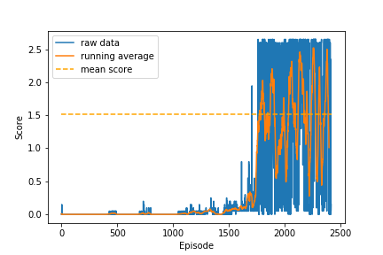

# Udacity Collaboration and Competition

### Environment Description

This repository contains code which uses deep deterministic policy gradient to teach two agents to play tennis.

In this environment, two agents control rackets to bounce a ball over a net. If an agent hits the ball over the net, it receives a reward of +0.1. If an agent lets a ball hit the ground or hits the ball out of bounds, it receives a reward of -0.01. Thus, the goal of each agent is to keep the ball in play.

The observation space consists of 8 variables corresponding to the position and velocity of the ball and racket. Each agent receives its own, local observation. Two continuous actions are available, corresponding to movement toward (or away from) the net, and jumping.

  

Video of 2 agents playing tennis with the Unity ML-Agents Tennis Environment.

The task is episodic, and in order to solve the environment, your agents must get an average score of +0.5 (over 100 consecutive episodes, after taking the maximum over both agents). Specifically,

After each episode, we add up the rewards that each agent received (without discounting), to get a score for each agent. This yields 2 (potentially different) scores. We then take the maximum of these 2 scores.
This yields a single score for each episode.
The environment is considered solved, when the average (over 100 episodes) of those scores is at least +0.5.

### Setting up the Repository

##### List of Dependencies

Below is the list of requirements.
<ul>
<li> python==3.6.3 </li>
<li> numpy==1.12.1 </li>
<li> matplotlib==2.1.0 </li>
<li> torch==0.4.0 </li>
<li> unityagents==0.4.0 </li>
</ul>

unityagents has been replaced by ml-agents

Can be installed with:
python -m pip install mlagents==0.30.0

##### Installation Procedure
Download the Unity Tennis environment from one of the links below. You need only select the environment that matches your operating system:

- Linux: **[click here](https://s3-us-west-1.amazonaws.com/udacity-drlnd/P3/Tennis/Tennis_Linux.zip)**
- Mac OSX: **[click here](https://s3-us-west-1.amazonaws.com/udacity-drlnd/P3/Tennis/Tennis.app.zip)**
- Windows (32-bit): **[click here](https://s3-us-west-1.amazonaws.com/udacity-drlnd/P3/Tennis/Tennis_Windows_x86.zip)**
- Windows (64-bit): **[click here](https://s3-us-west-1.amazonaws.com/udacity-drlnd/P3/Tennis/Tennis_Windows_x86_64.zip)**

Clone this repository using: git clone https://github.com/tauon1777/Udacity-Continuous-Control-Project.git

Place the zip file in the GitHub repository and unzip (or decompress) the file.

The agent should be ready to train.

If needed, additional instructions are located at:

[Udacity Project 2: Continuous Control](https://github.com/udacity/deep-reinforcement-learning/tree/master/p2_continuous-control).

[Udacity Deep Reinforcement Learning Repository](https://github.com/udacity/deep-reinforcement-learning#dependencies).

### Training an Agent

The main function is located in the Continuous_Control.ipynb file. Running the cells in this file will train an agent from scratch. It might be necessary to correct the path to the Reacher environment executable.

The agent trains for 4000 episodes by default, using the same hyperparameters outlined in the report. The performance of the agent should be comparable to the results below.

  

The file all_state_dicts.pt contains the saved network weights and optimizer states of a successfully trained agent.
